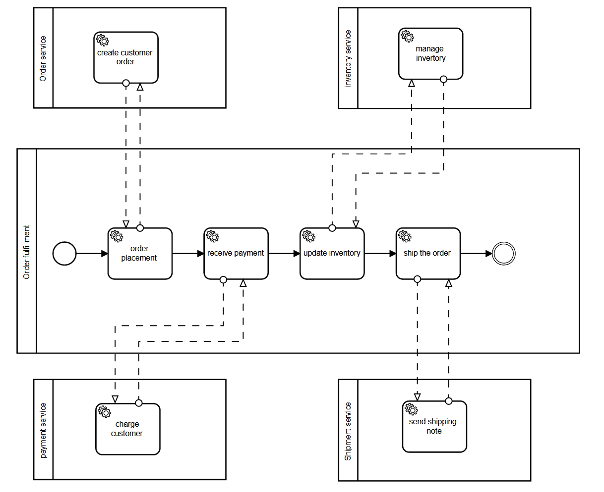

# Säntis Group

## Introduction
The Santis group is a grocery store that ships it's products to their customers' front door. Santis' customer has the option to make their order over their smart speaker. Once their order is placed, they receive a confirmation email that their order is being processed. Meanwhile their credit card is charged with their purchase and once the order is fulfilled they receive another email informing them that their package is on its way and a tracking number.

## Scenario
We took the scenario suggested by the lectures and adopted it into Santis process. We divided the process into four main process steps which are order placement, receive payment, update inventory and ship the order. In our integration scenario each process step is executed by a service.

1. The process starts when the customer makes their order. To simulate this we created an intent in dialague flow that contains training phrases that can be referenced when a customer places an order. 
2. Once the customer places their order, the order is inserted into a Google excel sheet through the integromat. At the same time the integromat also sends a confirmation email to the customers. This email contains a short message and the content of the order.
3. For the next steps in the order management we created jobs in talend to process the order.
4. In the order placement, talend reads the Google excel sheet and extracts from there the content of the order. IT then enters the information into the Database.
5. The finance job takes the order data and calculates the price of the order. It also checks if the credit card has enough money on it to cover the order price. Lastly, it subtracts the amount from the credit card.
6. The inventory job checks if the items ordered are instock and then updates the inventory numbers.
7. The shipping job creates a tracking number for the order and then sends an email to the customer. And completes the process by shipping the order to the customer.

We chose to state that the payement must be made before the inventory can be altered.

## Execution of each servies
### Order Service
(image dialague flow)

(image of integromat)

image of excel sheet

image of taled process

### Payment Service

### Inventory Service

### Shipment Service

1. In our scenario the customer places their order throught their google home.  Through the intergromat the dialague flow message is processed and enterd into a exael sheet on google docs.
2.The customer receives a confimation e-mail listing the content of their order.
3.
4.
5.