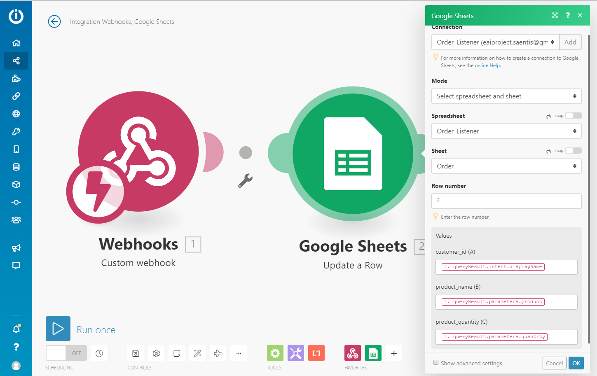

# Säntis Group

## Introduction
The Säntis group is a grocery store that ships it's products to their customer's front door. Säntis' clientele put in their order through their smart speaker. This incoming order triggers the process of charging the customer's credit card. Once the order is fulfilled they receive an e-mail informing them that their package is on its way, and are provided with a tracking number so they can trace their package.

## Scenario
We took the scenario suggested by the lectures and adopted it into Säntis process. As it was suggested, the process can be split into four main process steps: order placement, receive payment, update inventory and order shipment.

1. The order placement starts when the customer makes their order. To place it, they will use their smart speaker such as Alexa or Google Home.
2. Once the speaker takes and executes the order, it will be saved to a Table on Google Drive to later be accessed and processed.
3. The order payment starts with the reading of the order from the Google Excel sheet and is inserted into the database. 
4. As a next step the price of the articles ordered will be read from the product table. Then the order amount is taken and multiplied by the price to result in the order sum in Talend.
5. The order sum is then subtracted from the client's credit card.
6. The next step of updating the inventory is done by reading the order amount and updating it in the product table of the database.
7. Lastly, the order shipment requires the generation of a tracking number which is then sent in an email to the customer, confirming the shipping of the order.

## Implementation
We designed the process as a choreography. Meaning that the sub-processes would be linked among each other and not be delegated by a central brain. We chose to implement it this way because the order of the process steps was not going to change throughout this project. Although, implementing a process as a choreography brings the drawback of it being difficult to manage and maintain, this does not apply to our project since we do not plan on modifying it after completing the project. In regard to the disadvantage of it being difficult to monitor and track errors in a choreography, this did not affecte too strongly scine our project was small in size and complexity. Based on the way we implemented the process, the steps are of a synchronous nature, meaning that each process step has to be successfully completed for it to pass on to the next step. 

### Database
To implement the scenario we created a database for the project. The database has 5 tables: 

 - customer 
 - product 
 - orders 
 - shipping
 - maxorder 

The customer table contains the common attributes such as name and address but also the customer's credit card number and balance. The product table holds the list of products with the prices and the amount on stock. The orders table and maxorder both hold the same attributes such as customer and order ID, product name and quantity as well as the order sum. The difference between these two is that the order table holds all orders made and entered into the database where as maxorder only contains the most current order that is being processed. Lastly, the shipping table holds the tracking number of the shipment but only the newest order.

   * 

### Order placement
* The first step we implemented was the input of the order over the smart speaker. To simulate this, we use Dialoge Flow. In Dialoge Flow we created various intents such as 'Welcome' and 'Goodbye' to contain training words that the machine can recognize. We also created one that contained training phrases which would occur in our scenario.

    * 
    
    * 

* So as for the order entered in the Dialoge Flow to be processed, we linked it to the Integromat. In the Integromat we created a webhook and linked it to the Dialoge Flow. Through the webhook the order data will be taken and entered into a Google sheet.

    * 

* The order data in the google sheet called Order_Listener will always be overwritten with the newest order.

    * 

* To start the order placement task in Talend, the Google sheet has to be read by the program. For that to be possible, the file first has to be published to the Web. Then through the tFileFetch component it can be retrieved. The component is configured to read a specific protocol, in this case the protocol is https, and given an URI link to access the wanted file. If the file is fetched successfully, the next part of the job is triggered.
    
* The next job extracts the order data from the file and inputs it into the table orders, which is located in the database. Due to the structure of the downloaded google sheet file, which is now a .csv file, we use the tFileInputDelimited component. This component reads the content of a given file, with simple separated fields, row by row. In our example the field separators is a “,”. 

* The task of the following sub-job is for the newest line of the order table to be read and inputted into the maxorder. To make sure the last order made is read, the tAggregateRow component is used. It goes through the order_id column and looks for the largest number. The newest line is then entered into the maxorder table which at the same time overwrites the existing row in that table.

    * 

### Payment Service
* The next step is to collect payment from the customer. Before deducting anything from the clients credit card the total price of the order has to be calculated. This is done by first reading the product from the order. For this we use the component tMap, which compares the product names from maxorder and orders and generate a list of the products ordered. If this step fails the tSendMail component send an email to the projects Gmail address demonstrating an error. But if the step succeeds the extracted product names are passed on to the next component. 
* Once the ordered product names are read the prices for these have to be gathered. For this task we chose to create a Finance Job that has the task of reading the product name and returning its price. Therefore we implemented this job as a service in our project. To be able to implement the job in our flow we first had to create a Service Product_Order in Talend. Thus we set up a .wsdl file which defined the input and output parameters, in this case they are product name and product price respectively. We then saved the created service as metadata for it to be reused if necessary. Next we assigned the Finance Job to the Product_Order Service. Once the service is created it can be called by the tESBConsumer element. 
* If the service is successfully executed the output parameters are mapped to ensure that all products have receive a product price. If the price returned is false, in other words no value was returned, the tSendMail component will inform of the error in an email. If that is not the case the return variables will be mapped in the tMap component maxorder table. There the product price will be multiplied by the product quantity resulting in the total product sum. Once again if the tMap returns an error it is communicated by the tSendMail component else the value of order_sum in both the order and maxorder table is updated.

    * 

* Taking a closer look at the Finance Job, which is executed as a service, it is wrapped by tESBProvederRequest and tESBProvederResponse components that delimit the web service. In between we set tLogRow for the values process to be shown on the console. The vital part of this service is the XMLMap which goes through the inputted product names and compares it to the product_name column of the product table. If a match was made the value from the product_price field will be extracted. If the returned value is false an error email will be sent.

    * 

* Now that the total price of the order has been calculated, it can be deducted from the customers credit card. To do so the sub-job begins with mapping the maxorder and customer table through the customer ID.
    
    * 

 * When the match is made the value from the field order_sum from the maxorder table is store as a variable and the value of the field customer_balance from the customer table is stored as second variable. Then the first variable will be deducted from the second variable. The resulting value will be outputted as customer balance which in the next step is save to the database in the customer table.

    * 

### Inventory Service
* Before completing the purchase, the inventory of the products has to be updated. 

    * 

* The tMap fetches the maxorder and product tables and joins them through the product name attribute. It then finds the product stock from the product table and compares the amount to the quantity ordered. If the amount in stock is larger than the amount ordered, it subtracts the quantity ordered from the stock. This calculation is shown in the image below. 

    * 

* When the amount in stock falls below 0, it will load 100 more products to the inventory. The inventory is then updated in the database.

    * 

### Order Shipment
* The last step is the order shipment. This step requires the generation of a shipment ID for the customer’s order. The number is autogenerated when the order ID from maxorder table is entered into the shipping table. On the successful execution of that sub-job the shipment ID is read from the database. It is then embedded into an e-mail that is sent to the customer to inform them that their order in on its way.

    * 

    * 

### Issues / Workarounds
During the development of our Enterprise Application Integration we encountered a variety of different problems and errors. Below we stated short descriptions and the solution or workaround we chose for all major problems we faced.

* Installation of Talend
    * At the very beginning of the project, we had extreme difficulties to install the Talend software on our laptops. This might be due to the fact, that most members of our group use a Macbook. Another reason could have been the unavailability of XAMP. We had to use MAMP instead which also caused problems with Talend.
    * As a solution we installed Talend on our PC at home and during the coaching lessons, where we worked on our project, we established a TeamViewer connection to our Laptop. This way, a working Talend environment was ensured.

* Errormessage that caused Talend to crash
    * During the workprocess, an error message showed up quite frequently, which caused Talend to crash. The message popped up in various different jobs and elements. It seemed not to be triggered by a single job or action.
    * The solution is a mixture between the deactivation of the antivirus software "Avast" and changing the value for the Limit-field of the tFileInputDelimiter element at the beginning of the job.

    

* Fetching just the newest order from the database
    * The issue with reading just the newest entry from the database was, that the SQL-Statement in Talend did not accept a WHERE-clause. With the keyword MAX() we could filter the ID-field after the newest entry, but the rest of the table would be another one.
    * The idea for the solution came through the great effort of our lecturer and Talend-specialist Maja Spahic. She had the idea to get the highest ID of all the orders with the tAggregateRow element, and connect it to the corresponding entries in the database through a tMap lookup.

    

    * Then the newest order is written into a new database table "Maxorder" which concludes of just the newest entry always. To ensure this, the table is cleared before inserting the new data.

    

* Sending Emails via Talend
    * We could not send emails via the tSendMail element. We tried a lot of different combinations of ports, providers, email adresses and configurations of the element. But nothing seemed to help.
    * In the end, the solution was rather simple. Again the antivirus software "Avast" seemed to block all ports for Talend. With the deactivation of the software this problem could be managed.

* Using variables to display database values in a email text.
    * Another problem we faced was the use of variables in an tSendMail element to display values of the database like orderID or tracking number. At first, we tried to make the DB values useable through a tJavaRow element. After this did not work, we tried to hardcode the variables with a tJava element. But this did not work either.
    * To achieve this purpose, we used the ToIterate element from Talend. This elements allows us to use date from a connection to be further processed in a global variable.

    

    * Depending on the datatype, this global variable can then be used with the following statement directly within the body of the email. In our case, the integer with the name order_id is read and used as a global variable from the connection "row22". 

    

* Transformation from an XML structured value to a Double
    * With a service we compare a the product name in the order with the name in the table products to get the price of the product for further calculations. This price is outputted in XML format.

    

    * The issue with this was that in the beginning, we could not transform this xml output into a format whit which we could further calculate the sum of the order. We tried different Talend elements such as  tExtractXMLField, tFileInputXML etc.
    * What led to the solution in the end was far more easy. This was a typical case of "thinking to far". We just used another tXMLMap element and mapped the price to a field product_price as a Double.

    
