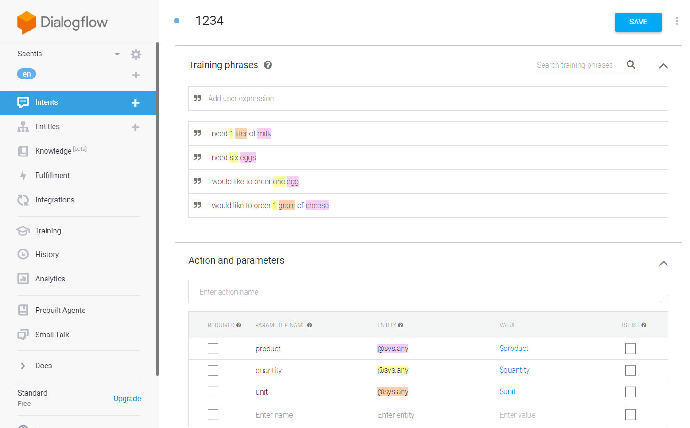
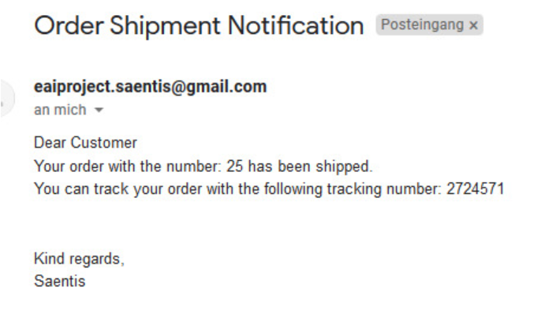

# Säntis Group

## Introduction
The Santis group is a grocery store that ships it's products to their customers' front door. Santis' customers put in their order through their smart speaker. The income of the order triggers the process of charging the customers' credit card. Once the order is fulfilled they receive an e-mail informing them that their package is on its way, and are provided with a tracking number so they can trace their package.

## Scenario
We took the scenario suggested by the lectures and adopted it into Säntis process. As it was suggested, the process can be split into four main process steps: order placement, receive payment, update inventory and order shipment.

1. The order placement starts when the customer makes their order. To place it, they will use their smart speaker such as Alexa or Google Home.
2. Once the speaker takes and executes the order, it will be saved to a Table on Google Drive to later be accessed and processed.
3. The order payment starts with the reading of the order from the Google Excel sheet and is inserted into the database. 
4. As a next step the price of the articles ordered will be read from the product table. Then the order amount is taken and multiplied by the price to result in the order sum in Talend.
5. The order sum is then subtracted from the client's credit card.
6. The next step of updating the inventory is done by reading the order amount and updating it in the product table of the database.
7. Lastly, the order shipment requires the generation of a tracking number which is then sent in an email to the customer, confirming the shipping of the order.

## Implementation
We designed the process as a choreography. Meaning that the sub-processes we would link among each other and not be delegated by a central brain. We chose to implement it this way because the order of the process steps was not going to change throughout this project. Additionally, implementing a process as a choreography brings the drawback of it being difficult to manage and maintain, this does not apply to our project since be do not plan on modifying it after completing the project. As to the disadvantage of it being difficult to monitor and track errors, we were able to avoid this because our project was small in size and complexity. Based on the way we implemented the process, the steps are of a synchronous nature, meaning that each process step has to be successfully completed for it to pass on to the next step. 

### Database
To implement the scenario we created a database for the project. The database has 5 tables: customer, product, orders, shipping and maxorder. The customer table contains the common attributes such as Name and address but also the customer's credit card number and balance. The product table holds the list of products with their prices and the amount on stock. The orders table and maxorder both hold the same attributes such as customer and order ID, product name and quantity as well as the order sum. The difference between these two is that the order table holds all orders made and entered into the database where as maxorder only contains the most current order that is being processed. Lastly, the shipping table holds the tracking number of the shipment but only not newest order.

### Order placement
The first implementation we did was the input of the order over the smart speaker. To simulate this, we use Dialogue Flow. In Dialogue Flow we created various intents such as Welcome and Goodbye to contain training words that the machine can recognize. We also created one that contained training phrases which would occur in our scenario (see picture).

To ensure the order entered in the Dialogue Flow will be processed we linked it to the Integromat. In the Integromat we created a webhook and linked it to the Dialogue Flow. Through the webhook the order data will be taken and entered into a Google sheet.

The order data in the google sheet called Order_Listener will always be overwritten with the newest order.

To start the order placement task in Talend, the Google sheet has to be read by the program first. For that to be possible the file first has to be published to the Web. Then through the tFileFetch component it can be retrieved. The component is configured to read a specific protocol, in this case the protocol https, and given an URI link to access the wanted file. If the file is fetched successfully the next part of the job is triggered.
The next job extracts the order data from the file and inputs it into the table orders, which is located in the database. Due to the structure of the downloaded google sheet file, which is now a csv file, we use the tFileInputDelimited component. This component reads a given file row by row with simple separated fields. In our example the field separators is a “,”. 
The task of the next sub-job is for the newest line of the order table to be read and inputted into the maxorder. To make sure the last order made is read, the tAggregateRow component is used. It goes through the order_id column and looks for the largest number. The newest line is then entered into the maxorder table which at the same time overwrites the existing row in that table.

### Payment Service

The next step is to collect payment from the customer. The ___ collects the order from ___ and matches the price to product through the max order, to calculate the order sum. This is calculated by multiplying the product price by the quantity ordered. If there is an error, then an e-mail is sent, identifying the problem. Through the process there are tlogs in place to ensure the service is working correctly. There are two database outputs in the payment service. One is to store the order sum in the order table and the other is to store it in the maxorder. To deduct the outstanding amount from the customers pre-existing balance, the max order table and customer table are joint through the customer ID. The order sum is subtracted from the customer's balance to make the payment. If however, there is not enough balance in the customer's account, then an additional 100 is added in the balance. The customer’s balance is then updated in the Customer table of the database.

### Inventory Service

Before completing the purchase, the inventory is checked for availability. It fetches the maxorder and product tables inner and is joint through the product name. Here it subtracts the quantity from the stock to ensure there is enough inventory of the ordered product. If however, there is not enough, it will load 100 more products to the inventory. Error catch? The inventory is then updated in the database.

 

### Order Shipment
The last step is the order shipment. This step requires the generation of a shipment ID for the customer’s order. The number is autogenerated when the order ID from maxorder table is entered into the shipping table. On the successful execution of that sub-job the shipment ID is read from the database. It is then embedded into an e-mail that is sent to the customer to inform them that their order in on its way.

### Issues
Issues we have encountered during our project were:
-Antivirus causes talend to crash
-File delimiter a limit has sometimes to be changed due to the same error message as from Antivirus
-Maxorder table due to issue with tmap and lookups